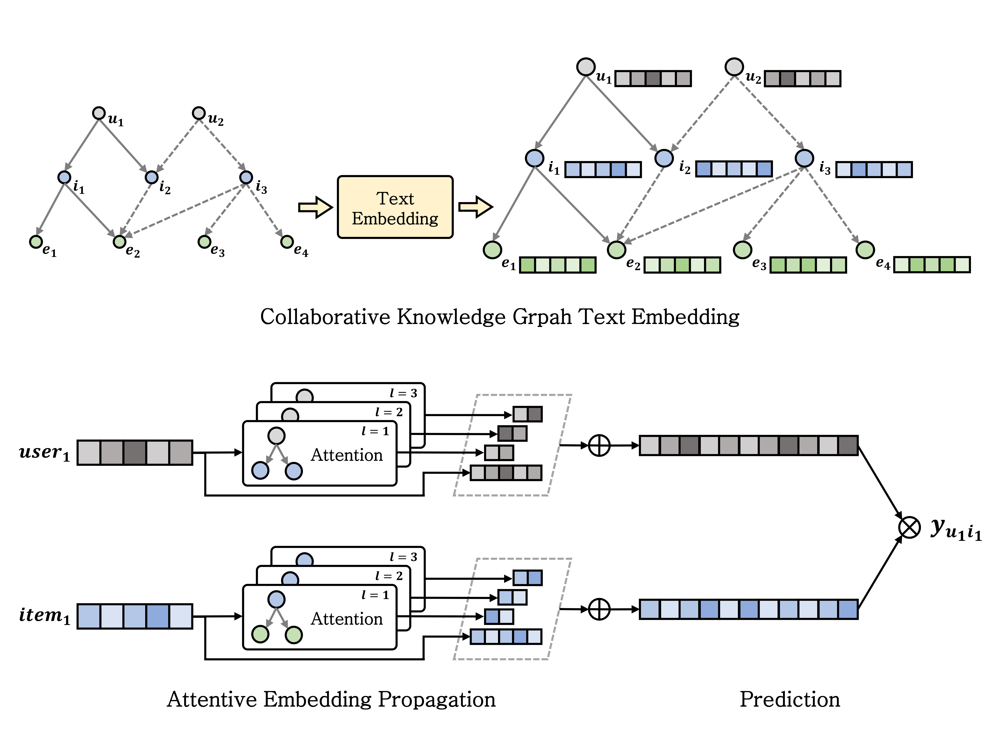

# KGAT-with-TextEmbedding
 

### 텍스트 부가 정보 활용을 위한 그래프 신경망 기반 추천 시스템  
#### [Graph Neural Network based Recommender System for Utilizing Textual Side Information](https://www.riss.kr/link?id=T16834777)
 
 

## Abstract
최근 정보의 양이 증가함에 따라 효율적으로 정보를 탐색해주는 추천 시스템의 역할이 중요해졌다. 그러나 기존의 추천 시스템은 정보량이 적은 데이터를 사용할 때, 데이터 희소성 문제가 발생한다. 본 연구의 목적은 텍스트 부가 정보를 추천 시스템에 활용하는 방법을 제시함으로써 데이터 희소성 문제를 완화하는 것이다. 본 연구는 자연어 처리 모델을 통해 텍스트 부가 정보를 임베딩하여 추천 모델의 입력값으로 사용하는 방법을 제안한다. 자연어 처리 모델로는 사전 학습된 BERT를 사용하였고, 추천 모델로는 지식 그래프와 그래프 신경망을 기반으로 구성되어 부가 정보 활용에 용이한 KGAT를 사용하였다. 실험 결과, 본 연구의 제안 방법은 기존의 추천 모델들보다 뛰어난 성능을 보였고, 희소 데이터에서도 효과적인 추천이 가능하다는 결과를 확인하였다. 따라서 본 연구의 제안 방법을 활용하여 텍스트 부가 정보를 추천 시스템에 적용하면 데이터 희소성 문제를 완화할 수 있다는 결론을 도출하였다.
 

&lt;Architecture of KGAT with Text Embedding&gt;

 
 
 

&lt;Performance comparison of KGAT and KGAT with Text Embedding including data sparsity situation&gt;

 
 
 

## Run the Code
### nlp.py
    --nlp : 텍스트 처리 기법 선택 (keyword / similarity / embedding)
    --file_input : 텍스트 데이터 csv 파일명
    
    ex) CUDA_VISIBLE_DEVICES=0 python nlp.py --nlp embedding --file_input melon_lyrics.csv

- Knowledge Graph에 활용할 텍스트 처리
  - keyword : 키워드가 동일한 아이템 저장
  - similarity : 텍스트 유사도가 높은 아이템 저장
  - embedding : BERT 모델로 추출한 텍스트 임베딩 저장
- datasets/melon/data/{args.nlp}.json 파일 생성
 

### main_kgat.py
    --data_name : 모델 학습에 사용할 데이터
    --use_embedding : Knowledge Graph의 Entity에 텍스트 임베딩 추가 여부 (0 or 1)
    --n_user : 모델 학습에 사용할 데이터 내의 user 수
    --data_size : data sparsity 상황 설정
        - normal : 선호하는 아이템이 10개 이상인 모든 user
        - big : 선호하는 아이템이 30개 이상인 user만 추출
        - small : 선호하는 아이템이 30개 미만인 user만 추출
    --n_epoch : epoch 수

    ex) CUDA_VISIBLE_DEVICES=0 python main_kgat.py --data_name melon --use_embedding 1 --n_user 1000 --data_size normal --n_epoch 200

- KGAT 모델 학습/평가
- Knowledge Graph와 텍스트 정보를 기반으로 아이템 추천
- 추가적인 argument 정보는 parser/parser_kgat.py에서 확인 가능
 
 
 

## References
- 본 코드는 [KGAT 모델을 Pytorch로 구현한 LunaBlack님의 코드](https://github.com/LunaBlack/KGAT-pytorch)를 기반으로 작성되었습니다.
- KGAT 모델 논문 : [KGAT: Knowledge Graph Attention Network for Recommendation](https://arxiv.org/pdf/1905.07854v2)
- 데이터 출처 : [Kakao Arena Melon Playlist Continuation](https://arena.kakao.com/c/8)
 
